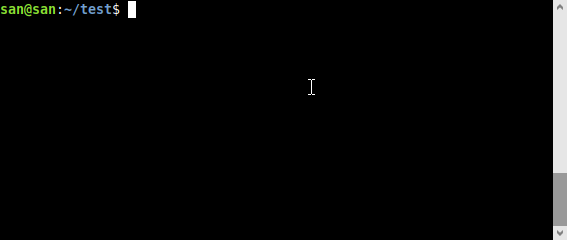

# Little Lambda Puppets (LLP)

Deploy your [Puppeteer](https://developers.google.com/web/tools/puppeteer) scripts to AWS lambda and run them using a URL or CRON job.

LLP takes care of the everything including setting up the chromium binary on AWS lambda,
creating lambda functions, adding an API gateway to invoke your functions with a GET request 
or adding CRON jobs (via AWS cloudwatch) to run your puppets every "X" minutes. 

LLP also monitors and notifies you of what your puppets are doing and it can send you alerts via email, telegram, or a simple URL ping.   

Best part is there are no handlers to write or messy configuration files to maintain. 
You just write your puppeteer scripts like before, then just type a single command:

 `llp deploy` - And that's all it takes to make them serverless!

## What LLP can do for you

Here are just a few real-life examples of what an LLP can do:
 
- Check your website every 5 minutes (and alert you via email or [telegram](https://telegram.org/) you if it's down or broken)
- Monitor the price of your favorite product on Amazon and alert you when it changes in real-time.
- Go to a website, fill a form and return results via a simple ajax request.
- Feed your database with fresh data automatically by scraping some website every X minutes.
- Create a screenshot of a website in jpg or pdf using a simple ajax request.
- And much much more!  

**It's [100% free](#cost)**, requires no servers (it's serverless!) and if used reasonably it doesn't cost you a single dime!

## Installation

Installation is simple. All you need is PHP 7+ with **[composer](https://getcomposer.org)**.



To install, just type this on your command line (terminal)

    composer create-project lambdapuppets/lambdapuppets project-name

This should create a *project-name* directory inside which there is a `puppets` directory. 

Put your [puppeteer scripts](#examples) inside this `puppets` directory and then run the following command: 

    llp deploy --verbose

*You may need to enter your AWS credentials as [described here](http://docs.aws.amazon.com/cli/latest/userguide/cli-chap-getting-started.html) (same as aws-cli)*.

If everything goes as expected, you should see this message:

    Your puppets are alive!
    
    To talk to your puppets just visit these URLs: 
    scraper: https://XXXX.execute-api.us-east-1.amazonaws.com/web/scraper

*(If you get a "command not found" error, make sure you have `./vendor/bin` in your PATH)*

That's it! Depending on each puppet it will either run as a cron job (i.e. every X minutes) or you can talk to it directly 
via its URL (as shown after deployment). 

## Examples

 - **Uptime puppet**

   This puppet checks a website every "X" minutes and send you a [telegram](https://telegram.org/) if something feels off.
   You can also configure it to send an email or ping a URL instead. 
     
   [source](examples/uptime.js) 

 - **Price watch puppet**

   This puppet checks the price of product every "X" minutes and notifies you if it changes (telegram, email, ping, sms, etc)
     
   [source](examples/pricewatch.js)
   
 - **Scraper puppet**

   This puppet does a search on DuckDuckGo for "chrome puppeteer" and returns the github link. 
   
   This puppet does not run automatically but you invoke it using a GET request (the URL that's shown after [deployment](#installation)). 
     
   [source](examples/scraper.js)
   
- **Screenshot puppet**

   This puppet turns a webpage into a pdf or png file. 
    
   This puppet can be invoked via a GET request (the URL that's shown after [deployment](#installation)).
        
   [source](examples/screenshot.js)

## Scripting

Here is an example of a very simple puppet:

````javascript
module.exports.run = async (browser, event) => {
  const page = await browser.newPage();
  await page.goto('https://example.com');
  
  return await page.content();
};
````
   
Save this code as `scraper.js` inside your `puppets` directory and run the following command on your terminal:

````bash
llp deploy --verbose
````
If things go as planned you should see the following output:

````
Your puppet is alive!

To talk to your puppet, just visit this URL: 
scraper: https://XXXX.execute-api.us-east-1.amazonaws.com/web/scraper
````    
   
### Two important differences

- You don't need `const puppeteer = require('puppeteer');` inside your puppeteer scripts to create a browser. Instead use the `browser` parameter passed to your function (as shown in the example above).
- You must always place your puppeteer code inside `module.exports.run = async (event) => {...}` as shown in the example above.  
   
## Activating puppets

In the scraper example above the puppet does not run until you visit the URL shown after deployment. It's a dormant puppet.

It is also possible to run your puppets via CRON. This will wake up your puppets every "X" minutes and pipe the results to you via telegram, email, sms, URL ping, etc.
This is called an active puppet.

To create active puppets:

- First create a `lambdapuppets.ini` in your project's root directory (i.e. the directory above your `puppets` directory)
- Then create a section named after your *puppet* as shown below

So if your puppet name is `scraper` (i.e. `scraper.js` in `puppets` dir), do this

##### lambdapuppets.ini
````ini
[scraper] 
cron=*/5 * * * ? *
enabled=true

[anotherpuppet]
...
````

This will run your scraper puppet every 5 minutes (as specified by the [schedule expression](https://docs.aws.amazon.com/AmazonCloudWatch/latest/events/ScheduledEvents.html) which are kind of a cron expressions) and send the output to telegram, email and url ping (if output body is empty then no action is taken).

## Testing puppets

To run a puppet locally for testing use the following command on your terminal

````bash
llp test --verbose puppet-name  
````

You can also pass event data to the puppet like this:

````bash
llp test --verbose screenshot -X url=https://www.example.com -X type=pdf 
````

## Piping results

Your active puppets (which run via cron) can send the output to telegram, email or a URL ping. This
is especially useful in CRON puppets. 

To pipe the output create another *export* in your puppeteer script as shown below:

````javascript
module.exports.config = {
    pipe: {
        telegram: {bot_id: 'botNNNNNN:YYYYY,-4354354354', chat_id: '-NNNNNN'},
        email: {from: 'you@domain', to: 'me@domain', subject: 'yo check this'},
        url: {target: 'https://xxx.requestcatcher.com/test'}, 
    }   
};
````

The pipe are triggered only if the result returned by your puppeteer script (or more specifically the `run` function exported by your script) is not empty.
 
This is useful since you don't want to get an alert every time your CRON is run, but rather only when there is something to report (e.g. site not responding, price change, etc). 

#### Telegram

You will need to create a telegram bot and get the bot_id and chat_id as [described in this post](https://stackoverflow.com/a/38388851/1031454).

The string for bot_id should look like this: `botNNNNNN:YYYYY` and chat_id should by just be a number. 

#### Email

Emails are sent via Amazon SES. Make sure you've [verified your email](https://console.aws.amazon.com/ses/home?region=us-east-1#verified-senders-email:) in your Amazon account first. 

#### URL

The puppet will make a POST request to a *URL* (with the output as request body). 

#### SMS / Phone

It is possible to send SMS / phone call too but it may require custom integration via [twilio](https://www.twilio.com). 

## Supported browsers

LLP supports these browsers:
- Chromium browser (default)  
- [Zombie browser](http://zombie.js.org/) (light weight nodejs browser)
- No browser (if all you need is the node.js `request` module)

It can be specified in your module configuration like this:

````javascript
module.exports.config = {
    browser: 'zombie', //none, chromium
}
````

## Configuration

By default LLP allocates 512MB ram with 3 minute timeout for your puppets. To change this, just edit `lambdapuppets.ini` and put custom values in the `default` section 
like this:

````ini
[default]
ram=1024M
timeout=120
````

## Removing puppets

To disable an active puppet, just make `enabled=false` in `lambdapuppets.ini` for that puppet. 

To remove all puppets and delete all AWS lambda functions use the following command on your terminal:

````bash
llp remove --verbose
````

## Cost

It's free and open-source. In addition to that AWS lambda also gives you 1 million free requests per month and 400,000 GB-seconds of compute time per month ([details here](https://aws.amazon.com/lambda/pricing/)). So it's virtually free for some lightweight puppeteering. 

## How to guides

- If you're new to Puppeteer, try these two tutorials: [tutorial #1](https://nitayneeman.com/posts/getting-to-know-puppeteer-using-practical-examples/), [tutorial #2](https://itnext.io/puppeteer-or-how-i-learned-to-stop-worrying-and-love-the-automation-92e96f4901e7?gi=5ac00b61b32c).
- Check out these [examples](examples) directory for some real-world use cases.
   
## Need more features?

This was just a weekend project for my own amusement but I will definitely add more features soon.

- Please [star this project](https://github.com/san-kumar/lambdapuppets) to show your interest.
- Leave me some feedback on this [HN thread](https://news.ycombinator.com/item?id=22751505) (please use *Issues* for bugs only).
- Contribute and send me PRs because isn't that what OSS is all about? :)

## Credits

This project uses [chrome-aws-lambda](https://github.com/alixaxel/chrome-aws-lambda) behind the scenes to create the headless browser on AWS lambda.

## License

The software is licensed using a GPL License. It means you can do whatever you want with it (including using it for commercial purposes freely), as long as you include the original copyright and license notice in any copy of the software/source.
